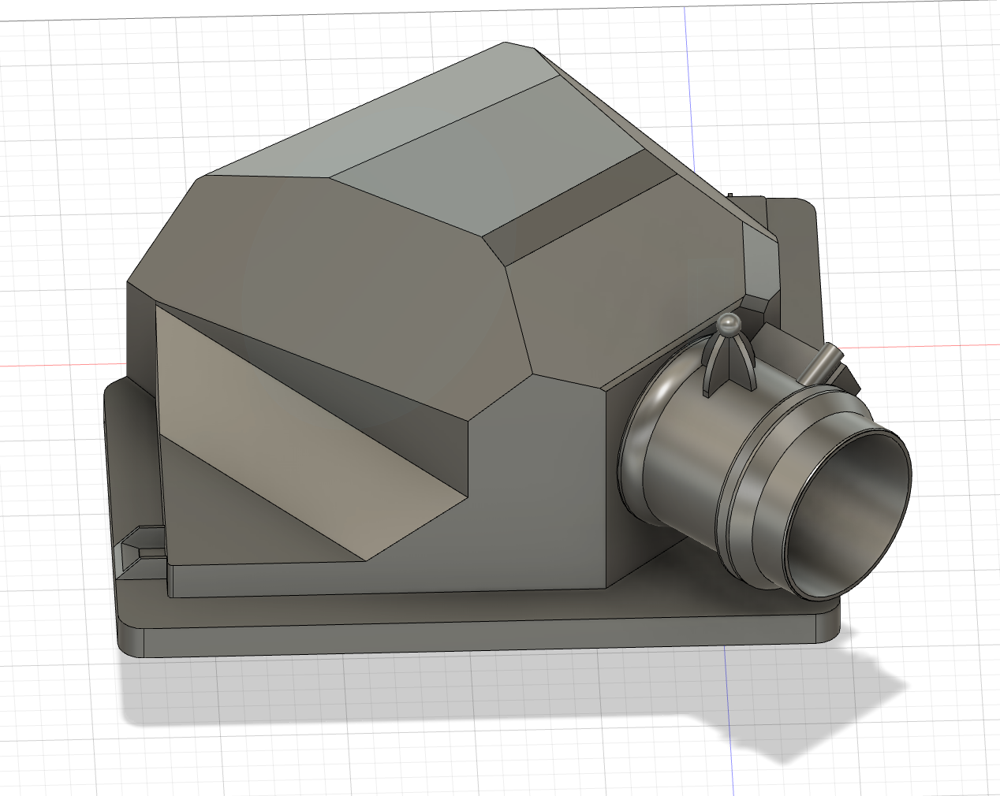
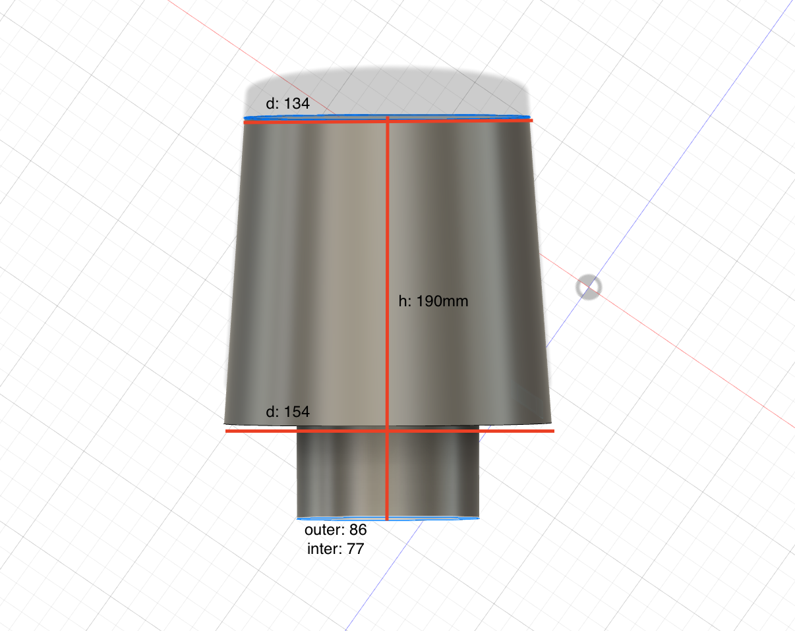

# BMW F30 B48 Air Intake Filter Mod

Custom air intake filter modification for BMW F30 with B48 engine.

### Images

## 3D Printing

The STL files are ready for 3D printing. Recommended settings:
- Material: ABS or higher temperature-resistant material
- Infill: 20-30%
- Layer height: 0.3mm

## Notes
- This may not 100% fit but fit enough
- Use `Intake.step` in your CAD software for any modifications
